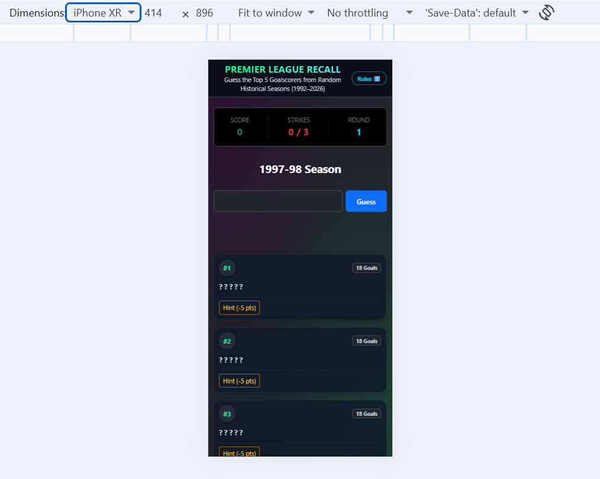
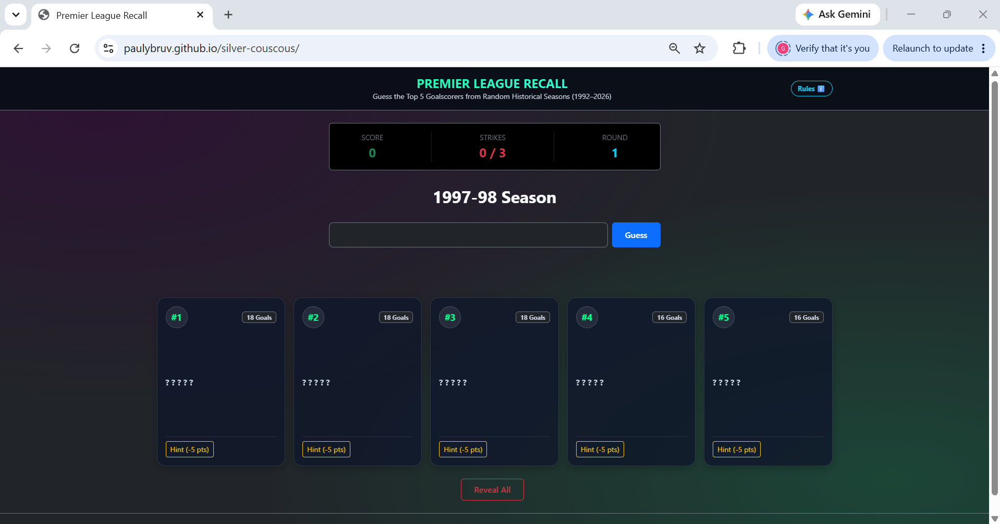
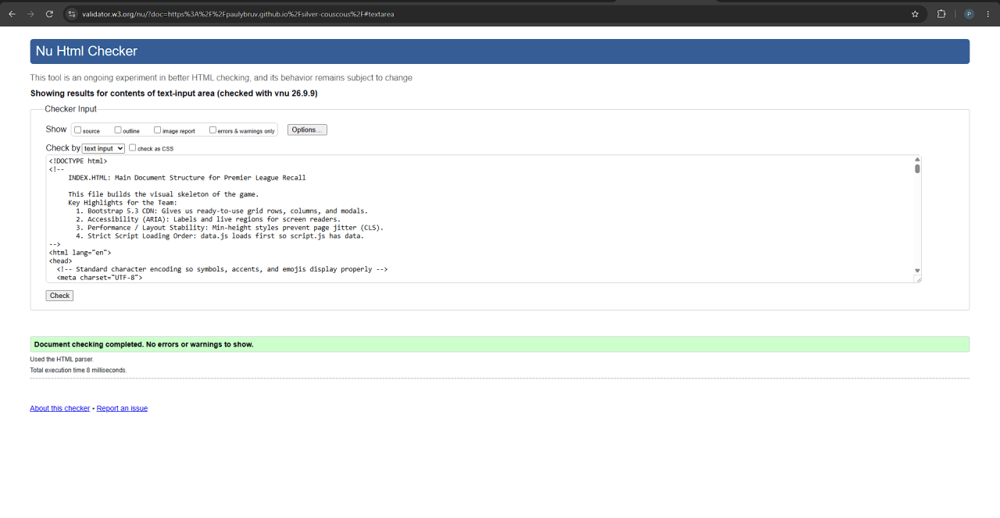
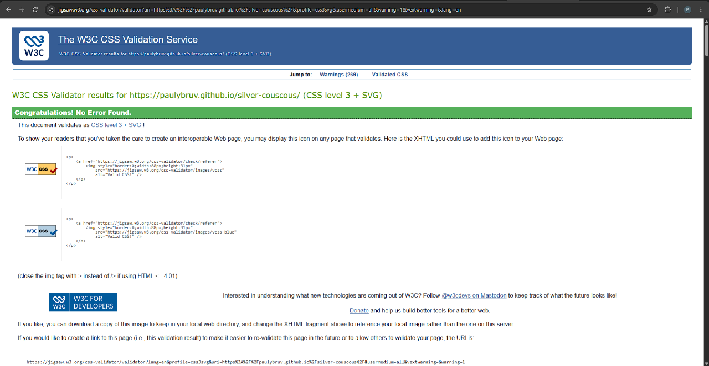

# Premier League Recall

A lightweight browser game where players try to recall the top 5 goalscorers from a random Premier League season. The game is built with plain HTML, CSS, and JavaScript and runs directly in the browser on desktop, tablet, and mobile devices.

## Contents
- [What the game does](#what-the-game-does)
- [Basic user case scenarios](#basic-user-case-scenarios)
- [How to run](#how-to-run)
- [How Our Team Used AI in This Project](#how-our-team-used-ai-in-this-project)
	- [Helping Us Build the Project](#1-helping-us-build-the-project)
	- [Fixing Bugs & Learning Along the Way](#2-fixing-bugs--learning-along-the-way)
	- [Improving How the Game Looks and Plays](#3-improving-how-the-game-looks-and-plays)
	- [What We Learned as a Team](#4-what-we-learned-as-a-team)
- [Basic wireframes](#basic-wireframes)
	- [Main game screen](#main-game-screen)
	- [Individual slot card](#individual-slot-card)
	- [End of round state](#end-of-round-state)
- [Why we split the JavaScript into a data file and script file](#why-we-split-the-javascript-into-a-data-file-and-script-file)
	- [Advantages of this approach](#advantages-of-this-approach)
	- [What could go wrong if we did not separate them](#what-could-go-wrong-if-we-did-not-separate-them)
	- [Developing an overall top scorer for every year](#developing-an-overall-top-scorer-for-every-year)
- [Project stack](#project-stack)
- [Notes](#notes)

## What the game does
- Shows a random Premier League season
- Challenges the player to guess the top 5 goalscorers
- Accepts full names, surnames, and common aliases
- Awards points for correct answers
- Allows a club hint for a lower score value
- Tracks strikes and ends the round after 3 incorrect guesses
- Reveals missed players and moves to the next season
- Works responsively across different screen sizes and devices

## Basic user case scenarios

### 1. Quick knowledge challenge
A user opens the game and wants to test how well they remember Premier League top scorers from recent or past seasons. They see the season heading, type a player surname, and submit guesses until they have identified all five scorers or used up their three strikes.

### 2. Learning from missed answers
A player is unsure of one of the names and clicks a club hint on a slot. The hint reveals the club, which helps them narrow down the player while costing them points. If they later guess correctly, they still get a smaller reward than a full unhinted answer.

### 3. Competitive score play
A user is trying to beat their previous score. Each correct guess adds points, a hidden card can be solved with a hint for fewer points, and a perfect round earns a clean sweep bonus. The score tracker updates live as the round progresses.

### 4. Casual replay loop
After a round ends, the game reveals any remaining players and gives the user the option to move on to the next season. The next round loads another random season, so the user can keep replaying without repetition.

### 5. Practice for football fans
A football fan uses the game as a quick memory exercise for seasons such as 2011-12, 2017-18, or other historical campaigns. The structure is easy to replay and encourages repeated play as they improve their recall.

## How to run
1. Download or clone the project.
2. Open the project folder in a browser.
3. Open the index.html file to start the game.

The app is designed to be responsive, so it can be played on a laptop, tablet, or mobile phone without needing a separate version for each device.

## Different Screen Views
-Mobile Screen view


-Desktop Screen view 


## How Our Team Used AI in This Project

As beginner developers, we used AI as a coding assistant and interactive tutor rather than letting it write the project for us. It helped us turn our game idea into a functional single-page app, walked us through confusing JavaScript bugs, and explained the logic behind the code so we could learn while building together.

---

### 1. Helping Us Build the Project
* **Building the 34-Season Data List:** Researching and typing out 34 seasons of Premier League top scorers by hand would have taken days and led to typos. We used AI to help format every season from 1992 to 2026 into clean JavaScript objects inside `data.js`. It also helped us add common player nicknames (like "RVP" or "Mo Salah") so the game recognizes how football fans actually refer to players.
* **Setting Up the Game Loop:** We knew our core rules—guess 5 players, allow 3 strikes, and deduct half points if you use a club hint. But connecting all that logic across the DOM was a challenge. We asked AI how to structure the basic game loop in `script.js`, from showing the blank cards on the screen to checking guesses and updating the score.

---

### 2. Fixing Bugs & Learning Along the Way
* **Sorting Out Ties and 6th-Place Players:** While testing seasons like 1995–96 and 2024–25, we noticed a big issue where players who finished in 6th place were showing up on the cards. For example, Teddy Sheringham finished 6th in 95–96 because two players tied for 4th above him. We used AI to help us check the actual tables for all 34 seasons so only true Top 5 players made it into the game.
* **Making Card #5 Work for Tied Players:** Our team decided that if players tie inside the top 4, they each get their own card. But if players tie for the final 5th spot, they should share Card #5. AI showed us how to use `isTied: true` and a small list of options inside `data.js`, so if a user types either player who tied for 5th, the game accepts it and reveals their name on that card.
* **Fixing Accented Letters in Names:** When testing names like **Ole Gunnar Solskjær** or **Sadio Mané**, the game gave us a strike if we typed "Solskjaer" or "Mane" with standard letters. AI taught us how to use `.normalize("NFD")` in our sanitize function. This strips off the accent marks before checking the answer, making the game fair and forgiving.
* **Stopping Double Strikes on the Same Wrong Guess:** At first, if you accidentally typed the same wrong name twice, the game took two of your three strikes. AI showed us how to use a JavaScript `Set` to store wrong guesses, so the game can spot repeats and just show a warning message instead of taking another life.
* **Fixing the "Loading..." Bug on Startup:** When we first opened our game, the cards were completely missing and the screen was stuck on "Loading...". AI told us to look in the browser console, where we saw an error showing `script.js` was trying to run before `data.js` had even loaded. Swapping the order of our `<script>` tags in `index.html` fixed it straight away.

---

### 3. Improving How the Game Looks and Plays
* **Adding the Rules Popup:** We wanted a simple way for players to check how the game works and how the 5th-card tie-breaker works without cluttering the main screen. AI helped us add a clean "Rules ℹ️" button in the top corner that opens a Bootstrap modal window explaining everything clearly.
* **Fixing Header Overlap on Mobile:** When testing on narrow phone screens, the Rules button ended up colliding with our subtitle text. Instead of hiding the subtitle, I resolved the layout issue myself by adjusting the styling and flex alignment so the text wraps naturally underneath, giving both the title and the Rules button dedicated breathing room without clipping any information.
* **Stopping the Page From Jumping Around:** When cards appeared or feedback messages popped up, the bottom half of the screen would jump down awkwardly. AI explained that this happens when elements don't have reserved space, and suggested adding `min-height` to our card container and heading in CSS so the screen stays completely still.
* **Making It Friendly for Screen Readers:** AI guided us on adding `role="alert"` and `aria-live="polite"` to our message box. This means people using screen-reading software can hear whether their guess was right or wrong without needing to refresh the page.

---

### 4. What We Learned as a Team
* **Understanding the Code Before Using It:** We made a point never to copy and paste code without understanding what it did. When AI suggested the **Fisher-Yates shuffle** to randomize seasons, we asked it to explain how the math worked so we understood why it prevents repeat seasons better than simple random sorting.
* **Splitting Data and Game Logic:** AI advised us from the start to keep our season info in `data.js` and our game code in `script.js`. This kept our workspace neat and made it much easier for team members to work on styling, aliases, or testing without getting in each other's way.
* **Better Team Habits:** Asking AI how to structure clear Git commit messages gave our team more confidence when working on branches and pushing updates together.

## Basic wireframes

### Main game screen

```text
+--------------------------------------------------------------+
| Premier League Recall         Score: 0     Strikes: 0/3      |
+--------------------------------------------------------------+
|                       2011-12                                |
|      Can you name the top 5 goalscorers from this season?     |
|                                                              |
|  [Enter Player Surname or Full Name]   [Submit]              |
|  Feedback message here                                        |
|                                                              |
|  [Card 1]   [Card 2]   [Card 3]                              |
|  [Card 4]   [Card 5]                                         |
|                                                              |
|  [Reveal Remaining]     [Next Season]                        |
+--------------------------------------------------------------+
```

### Individual slot card

```text
+--------------------------------------+
| #1 | ???                    |
| ??? goals | ???                    |
| [Club Hint (-5 pts)]               |
+--------------------------------------+
```

### End of round state

```text
+--------------------------------------------------------------+
| Premier League Recall         Score: 120   Strikes: 3/3      |
+--------------------------------------------------------------+
| Round over! The remaining scorers have been revealed.        |
|                                                              |
|  [Card 1]   [Card 2]   [Card 3]                              |
|  [Card 4]   [Card 5]                                         |
|                                                              |
|                           [Next Season]                      |
+--------------------------------------------------------------+
```

## Why we split the JavaScript into a data file and script file
This project uses two JavaScript files:
- data.js contains the season data and player information
- script.js contains the game logic, event handlers, scoring, and round flow

This separation is useful because it keeps the project easier to maintain. The data file acts like a structured source of information, while the script file focuses on how that information is used in the game. This makes it simpler to update the player list or add new seasons without rewriting the logic. It also helps keep the code organised, clearer to read, and easier to debug when something goes wrong.

### Advantages of this approach
- Cleaner code structure: data and logic are kept in separate places
- Easier updates: new players or seasons can be added to the data file without changing the game logic
- Better maintenance: developers can work on the game rules without affecting the dataset
- Reusability: the same data can be loaded into other scripts or future versions of the app
- Improved readability: the project is easier for new developers to understand

### What could go wrong if we did not separate them
If all the data and logic were placed in one JavaScript file, the project could become harder to manage. It would be more difficult to find specific parts of the code, update player information, or fix logic errors without accidentally changing the data. The file could become long and cluttered, making the app harder to test, harder to scale, and more likely to contain bugs when making future changes.

In a larger project, keeping data separate also helps with version control and collaboration, because one developer can update the dataset while another works on the game engine without creating unnecessary conflicts.

### Developing an overall top scorer for every year
The information already stored in `data.js` can also be used to find the overall top scorer across all of the seasons. We could loop through `seasonsData`, examine each season's `topScorers`, and add each player's goals to a total. For normal entries, the player's `name` and `goals` can be read directly. For a tied fifth-place entry, the players are stored inside `tiedOptions`, so the code would need to add the same `goals` value to each eligible player.

For example, `script.js` could use a function like this:

```js
function getOverallTopScorers() {
	const playerTotals = {};

	seasonsData.forEach((season) => {
		season.topScorers.forEach((scorer) => {
			const players = scorer.isTied ? scorer.tiedOptions : [scorer];

			players.forEach((player) => {
				playerTotals[player.name] = (playerTotals[player.name] || 0) + scorer.goals;
			});
		});
	});

	return Object.entries(playerTotals)
		.map(([name, goals]) => ({ name, goals }))
		.sort((firstPlayer, secondPlayer) => secondPlayer.goals - firstPlayer.goals);
}

const overallTopScorers = getOverallTopScorers();
console.log(overallTopScorers);
```

This creates a total for every player across all seasons, then sorts the totals from highest to lowest. The first item in the returned array would be the overall top scorer, while the rest could be displayed as a leaderboard. If two players have the same total, the interface could show both players as joint top scorers by filtering for everyone whose total matches the highest total. This approach reuses the existing data and means that adding another season to `data.js` automatically includes it in the calculation.

## Project stack
- HTML
- CSS
- JavaScript
- Bootstrap 5

## Code Testing





## Notes
This build is a static front-end game and does not require a backend or database setup. It is built to be accessible and easy to use on any device, regardless of screen size.